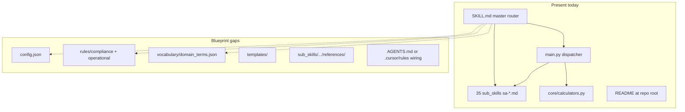

# Claude Desktop vs Blueprint — Improvement Review

## Assessment summary

[Claude Desktop/](Claude Desktop/) is correctly classified as **Tier 2: Professional Suite** per the blueprint: master [`SKILL.md`](Claude Desktop/SKILL.md), 35 modules under [`sub_skills/`](Claude Desktop/sub_skills/), optional [`main.py`](Claude Desktop/main.py) dispatcher, and [`core/calculators.py`](Claude Desktop/core/calculators.py). The repo root [`README.md`](README.md) documents installation and usage well.

Against the blueprint **Quality Checklist (Section 9)** and **Tier 2 canonical tree (Section 4)**, the suite scores well on routing breadth and KSA domain depth, but is **incomplete on governance scaffolding** (config, rules, vocabulary, templates) and **inconsistent on sub-skill contracts** (cross-link tables, halt rules, persona).



---

## What already aligns with the blueprint

| Blueprint expectation | Current state |
|----------------------|---------------|
| Tier 2 multi-module suite | 35 `sa-*` modules + master router |
| Master under ~500 lines | [`SKILL.md`](Claude Desktop/SKILL.md) is ~199 lines |
| Trigger-rich `description` | Strong WHEN clauses (SBC, SCD, SBPS, Mostadam, giga authorities) |
| Markdown + Python routing | Decision tree in master; `valid_skills` in [`main.py`](Claude Desktop/main.py) (34 IDs) |
| Quantitative layer where needed | Five calculator types with AHJ disclaimer in [`core/calculators.py`](Claude Desktop/core/calculators.py) |
| Progressive disclosure intent | Quick reference in Section 1; depth in sub-skills |
| Golden-path documentation | Repo [`README.md`](README.md) with example prompts and sub-skill index |

---

## Gap analysis (by blueprint section)

### 1. Missing Tier 2 infrastructure (Section 4, 6)

The blueprint canonical tree expects these alongside `SKILL.md`:

| Artifact | Status | Impact |
|----------|--------|--------|
| [`config.json`](Blueprint & Toolkit- Creating High-Performance Claude Professional Skills.md) | **Missing** | No machine-readable `strict_mode`, jurisdiction bounds, or iteration limits |
| [`rules/compliance.md`](Blueprint & Toolkit- Creating High-Performance Claude Professional Skills.md) | **Missing** | No centralized **hard-stop** rules (licensed acts, citation integrity, SBC/SCD non-compliance) |
| [`rules/operational.md`](Blueprint & Toolkit- Creating High-Performance Claude Professional Skills.md) | **Missing** | No SOP for intake, escalation, artifact naming |
| [`vocabulary/domain_terms.json`](Blueprint & Toolkit- Creating High-Performance Claude Professional Skills.md) | **Missing** | SBC, SBPS, Mostadam, AHJ, NOC, etc. defined only inline — risk of ambiguous acronyms |
| [`templates/`](Blueprint & Toolkit- Creating High-Performance Claude Professional Skills.md) | **Missing** | Output shape varies per module; no shared memo/checklist shells |
| `sub_skills/<id>/references/` | **None exist** | Dispatcher exposes `references_available` but ships zero deep refs |

**Improvement:** Add the five folders/files and wire Phase 1–2 of the master cognitive workflow to them (blueprint Section 5, lines 234–244).

Suggested `config.json` fields for this domain:

- `target_governance_framework`: SBC + SCD + SBPS/MoMRAH (+ special authorities)
- `enforce_jurisdictional_bounds`: true (city/AHJ must be stated before code-specific conclusions)
- `allow_assumptions`: false or explicit baseline-only
- `require_framework_citations`: true for regulatory claims

---

### 2. Master orchestrator vs blueprint Section 5

[`SKILL.md`](Claude Desktop/SKILL.md) has identity, KSA quick reference, ASCII routing tree, and dispatcher docs — but diverges from the blueprint orchestrator in several ways:

| Blueprint element | Gap |
|-------------------|-----|
| **4-phase cognitive workflow** (Ingest → Validate → Analyze → Synthesize) | Not structured; only informal “ask for missing info” |
| **Phase 2 compliance validation** referencing `./rules/` | No rules files to apply |
| **Phase 4 templates** | No `templates/` |
| **Third-person skill description** | Description is third person; body mandates **first-person** persona — acceptable product choice, but document it in `rules/operational.md` as intentional |
| **“Start with deliverable, no filler”** (Section 5 + checklist) | Conflicts with rule: *“Begin every reply with a short, natural greeting”* — pick one standard and encode in operational rules |
| **Sub-skill routing table** (markdown table) | Tree exists; blueprint also wants a compact **Topic \| Sub-skill ID \| Load when** table for scanability |

**Improvement:** Add Sections “Cognitive workflow” and “Compliance halt” to master `SKILL.md` that point at new `rules/` and `config.json`; reconcile greeting vs no-preamble rule.

---

### 3. Sub-skill template (Section 4) — systematic gap

Blueprint requires each module to include:

```markdown
## When to Use This Skill
| Question type | This skill | Use instead |
```

**Finding:** **0 of 35** sub-skills contain `When to Use` or `Use instead` tables (grep across [`sub_skills/`](Claude Desktop/sub_skills/)).

Some modules have informal routing (e.g. [`sa-building-codes`](Claude Desktop/sub_skills/sa-building-codes/sa-building-codes.md) Section 5 “Sub-Specialty Routing”), but format is inconsistent.

**Improvement:** Add a standard front section to every sub-skill:

- “When to Use” matrix (3–8 rows)
- “For X, use `sa-other` instead” (reduces overlap with `sa-fire-life-safety` vs `sa-scd-licensing-compliance`, `sa-op-submission-strategy` vs `sa-consent-scheduling`, etc.)
- Explicit **halt conditions** per module (e.g. missing AHJ, no stamped fire strategy before occupancy advice)

---

### 4. Routing and dispatcher integrity (high priority)

| Issue | Evidence | Recommended fix |
|-------|----------|-----------------|
| **Orphan module** | [`sa-architect-foundations`](Claude Desktop/sub_skills/sa-architect-foundations/sa-architect-foundations.md) has `auto-activate: true` but is **not** in [`main.py`](Claude Desktop/main.py) `valid_skills` (34 entries) or master routing tree | Either register in dispatcher + tree, or **delete/merge** into master `SKILL.md` Section 1 |
| **Duplicated routing tree** | Foundations file duplicates ~full decision tree already in master | Single source of truth: master only; foundations becomes thin “persona + discovery” or is removed |
| **Count mismatch** | 35 folders on disk, 34 routable | Document the 35th role explicitly or remove orphan |

---

### 5. Frontmatter and platform conventions (Section 3)

| Field | Blueprint (Cursor) | Claude Desktop suite |
|-------|-------------------|------------------------|
| `disable-model-invocation` | Default `true` | Not used |
| `user-invocable` | N/A in blueprint | `true` on almost all modules |
| `auto-activate` | N/A | Only on foundations (broken wiring) |

**Improvement:** Document platform mapping in [`rules/operational.md`](Blueprint & Toolkit- Creating High-Performance Claude Professional Skills.md): Claude Desktop plugin fields vs Cursor fields. Do not blindly add `disable-model-invocation` if it breaks Desktop discovery.

Sub-skill filenames use `{id}.md` not `SKILL.md` — matches blueprint Tier 2 template (`<module-id>.md`). **No rename required** unless Claude Desktop discovery docs mandate `SKILL.md` per folder (verify against current Desktop plugin spec before renaming).

---

### 6. Quality checklist (Section 9) — scored gaps

| Checklist item | Status | Improvement |
|----------------|--------|-------------|
| Explicit measurable constraints | Partial (prose only) | Add threshold table in `rules/compliance.md` (e.g. when to escalate SCD red flags, calculator proxy limits) |
| Description triggers | **Pass** | Keep; audit length under 1024 chars per module |
| Vocabulary populated | **Fail** | Create `vocabulary/domain_terms.json` with 20–40 KSA terms |
| Halt criteria documented | **Partial** | Centralize licensing/advisory-only boundaries + “do not invent SBC clause” |
| Master under 500 lines | **Pass** | Maintain after adding workflow section |
| Sub-skills cross-link | **Fail** | Add “use instead” tables to all 35 |
| No AI fluff | **Mixed** | Resolve greeting rule; enforce deliverable-first in templates |
| Assumptions declared | Partial in master | Require explicit “assumptions” block in template |
| Formulas justified | **Pass** for calculators | Keep disclaimers; link `sa-architect-calculator` from modules that cite numbers |
| Plan Mode golden questions | **Fail** | Add `VERIFICATION.md` with 3 blueprint prompts (routine / deep route / compliance halt) |

---

### 7. Anti-patterns (Section 10)

| Anti-pattern | Present? | Fix |
|--------------|----------|-----|
| Duplicate sub-skills | **Yes** — foundations vs master | Merge/dedupe |
| Missing jurisdiction flags | **Yes** — AHJ only in prose | `config.json` + mandatory intake in Phase 1 |
| Personal branding in anonymous suite | **Yes** — “Rico Kwok” in [`sa-consent-scheduling`](Claude Desktop/sub_skills/sa-consent-scheduling/sa-consent-scheduling.md), [`sa-minor-works`](Claude Desktop/sub_skills/sa-minor-works/sa-minor-works.md), [`sa-practical-completion-snagging`](Claude Desktop/sub_skills/sa-practical-completion-snagging/sa-practical-completion-snagging.md) vs master “without using any personal name” | Remove personal names; align with master identity rule |
| Deep reference chains | N/A (no refs) | Add `references/` only where statutes/checklists exceed ~150 lines |
| Vague professionalism | Low risk | Templates will standardize tone |

---

### 8. Activation and verification (Section 8)

| Item | Status |
|------|--------|
| `AGENTS.md` or `.cursor/rules/` activation snippet | **Missing** in repo |
| README inside `Claude Desktop/` | **Missing** (only repo root README) |
| Golden verification prompts | **Missing** |

**Improvement:** Copy or symlink quick-start into `Claude Desktop/README.md`; add [`AGENTS.md`](Blueprint & Toolkit- Creating High-Performance Claude Professional Skills.md) at repo root with trigger domain and halt-rule pointer for Cursor users.

---

### 9. Minor / hygiene

- [`LICENSE`](Claude Desktop/LICENSE): MIT copyright **Abhinav Bhardwaj** — likely template; update to project owner or remove if unused.
- Blueprint **Appendix** (line 469) still says “Hong Kong architecture practice” — the implementation is **KSA**; fix blueprint text when editing docs (meta, not suite code).
- [`main.py`](Claude Desktop/main.py) legacy comment for `sa-minor-work.md` typo — harmless; remove when touching dispatcher.

---

## Prioritized improvement backlog

### P0 — Correctness and routing (do first)

1. Resolve **`sa-architect-foundations`**: register in `valid_skills` + master tree **or** merge into master and delete duplicate tree.
2. Remove **personal name** references in three sub-skills; enforce master anonymity rule suite-wide.
3. Add **`rules/compliance.md`** with universal + KSA packs (advisory-only PI/legal limits, no invented citations, SCD “red line” halts).

### P1 — Blueprint Tier 2 completeness

4. Add **`config.json`**, **`vocabulary/domain_terms.json`**, **`rules/operational.md`**.
5. Add **`templates/`** (minimum: authority memo, compliance gap log, handover punch-list).
6. Extend master **`SKILL.md`** with 4-phase workflow + links to config/rules/vocabulary.
7. Add **“When to Use \| Use instead”** table to all 35 sub-skills (batch edit with shared template).

### P2 — Depth and verification

8. Populate **`references/`** for the 5–8 heaviest modules (e.g. `sa-building-codes`, `sa-fire-life-safety`, `sa-scd-licensing-compliance`, `sa-op-submission-strategy`).
9. Add **`VERIFICATION.md`** golden questions per blueprint Section 8.
10. Add **`AGENTS.md`** + `Claude Desktop/README.md` for dual Cursor/Desktop activation.

---

## Suggested `domain_terms.json` starter (non-exhaustive)

Include at minimum: **SBC**, **SBCNC**, **SBPS**, **SCD**, **NOC**, **AHJ**, **Baladiya**, **Mostadam**, **Is’har** (occupancy certificate), **BUA**, **FLS**, **IST**, **SASO**, **NEOM**, **RSG**, **DGDA**, **MoMRAH**, **DfMA**, **DLP**, **FIDIC** (advisory context only).

---

## Files to touch when implementing (reference)

| Action | Primary files |
|--------|----------------|
| Governance scaffold | New: `Claude Desktop/config.json`, `rules/*.md`, `vocabulary/domain_terms.json`, `templates/*.md` |
| Master orchestrator | [`Claude Desktop/SKILL.md`](Claude Desktop/SKILL.md) |
| Dispatcher sync | [`Claude Desktop/main.py`](Claude Desktop/main.py) |
| Sub-skill standardization | All files under [`Claude Desktop/sub_skills/`](Claude Desktop/sub_skills/) |
| Foundations decision | [`sa-architect-foundations.md`](Claude Desktop/sub_skills/sa-architect-foundations/sa-architect-foundations.md) |
| Persona cleanup | `sa-consent-scheduling`, `sa-minor-works`, `sa-practical-completion-snagging` |
| DX | New: `AGENTS.md`, `Claude Desktop/VERIFICATION.md`, optional `Claude Desktop/README.md` |

---

## Note on intentional deviations

These are **not necessarily bugs** if documented in `rules/operational.md`:

- **First-person senior architect persona** (blueprint defaults to objective third person in descriptions only).
- **`user-invocable: true`** on sub-skills (Claude Desktop pattern vs Cursor `disable-model-invocation`).
- **Greeting before deliverable** — product preference; document explicitly to avoid contradicting blueprint “no filler” guidance.
